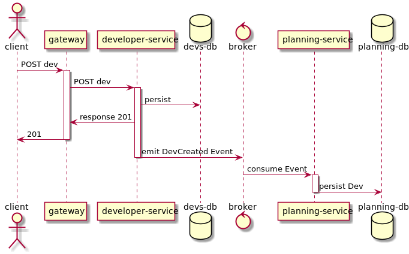

= Buggy - A Demo App for Microservices
Dirk Kutzer
1.0, 31.10.2019: Halloween Release
:toc-title: Inhaltsverzeichnis
:toc:
:icons: font
ifdef::env-github[]
:imagesdir: /
endif::[]

The goal of this project is to demonstrate a possible architecture for building microservices on top Spring Boot with Kotlin.
There won't be any fancy business logic but a full stack of technologies.
As an example the buggy-platform imitates an issue tracker like bugzilla or Jira.

'''

Features:
====
* Create/Update/Delete of so called Basic-Data: 
** Developers
** Issues (Bugs and  Stories)
* Doing a Planning for estimated Stories
====


== How to build an run

=== Pre-requirements
* Docker 
* Docker-Compose

=== Build and Run
[source,Bash]
----
/bin/bash buildAndRun.bash
----
This will build the jar of each component and start the compose file.

=== Hints
====

* On Linux you can run the script `/sudo ./addDNS_buggy.sh`. This will modify your local /etc/hosts file with the internal IPs of all services.
So you can access each component without any port forwarding.
* On first start the process will take several minutes for downloading 
** the `gradle` wrapper
** all dependencies
** docker images (mongodb, kafka...)
====


== The Microservice Architecture explained

=== Domains
The demo is divided in so called 'Domains'. Every domain is handled by it's own Microservice.
Which means this service manages and persists the data belonging to his domain and offering interfaces/endpoints to access the data and execute the business logic.
In this example of an issue tracker there a 3 business domains:
* Developers: basic data about the developers 
* Issues: basic data about a the things need be done
* Planning: making a plan about doing all the work based on developers and issues

A domain-service can handle multiple entities and controller.

=== Decoupling and Messaging
Every service can offer full functionality even if other services are not available. This is achieved via `view-data` and messaging.

==== View-Data
Every services persists all data needed to do it's work. In the case of the planning-service this means,
it needs some data about the available developers and data about the work about to be planned (estimated stories).
It would be a very simple but also very bad idea to request all these data on demand via Rest or something similar. Some disadvantages would be:
* increasing workload (net-io) over time 
* synchronous and slow processes
* more memory consumption (the services would hold the data in-memory on every request)
* no functionality if only one of the other services would be down for whatever reason

To overcome these things the planning-service consumes events about the data he needs and persists this data in its own database.

==== Messaging
The services don't know each other. The `planning-service` has  no idea about the origin of the events about developers and issues. There is only a message broker. (Kafka)


|===
|Pattern |Example

| image:static/ProducerConsumerPattern.png[]

| 

|===

Example:
When a new issue is created in the issues-service the service emits an event `IssueCreated` containing all properties of the just created issue.
The planning-service is listening with his own Queue on the "Issues" Exchange and consumes the event and it's data right away.
The Planning-Service also validates and persists the needed parts/properties of the data in its own database.
The both services have no knowledge of each other. They don´t share a database.



TODO: Replay and REST Fallback

=== Blackbox
The endpoints and interfaces of all services are gathered and made public via a an api-gateway.
A client (like any user interface or web app) would only access the endpoints via this gateway.
Never directly via one of the services. This way it is very easy to add modify or delete the underlying services without changing the API in any way.

==== Testing via Contract Tests (Pacts)

The 3 Microservices communicate via Messaging. To make sure the MessageListeners (Consumer) and the MessageProducer (Provider)
sending and reading the same structure of data the Contract Tests are used.

ifdef::env-github[]
[source,kotlin]
----
@Provider("dkutzer-msdemo-buggy-developers-messaging")
@PactFolder("../pacts")
@ExtendWith(MockKExtension::class)
class DeveloperMessagingProviderPactTest {
----
endif::[]
ifndef::env-github[]
[source,kotlin]
----
include::developer-spring/src/test/kotlin/de/dkutzer/buggy/developer/boundary/DeveloperMessagingProviderPactTest.kt[tag=PACT]
----
endif::[]


==== HATEOS
Spring Rest Data offers a simple way to add HATEOS out of the box. This is all achieved by simple annotating the specific repository:

ifdef::env-github[]
[source,kotlin]
----
@RepositoryRestResource(collectionResourceRel = "developer", path = "developers")
@JaversSpringDataAuditable
interface DeveloperRepository : MongoRepository<Developer, String>{
----
endif::[]
ifndef::env-github[]
[source,kotlin]
----
include::developer-spring/src/main/kotlin/de/dkutzer/buggy/developer/control/Repositories.kt[tag=HATEOS]
----
endif::[]


=== Resilience

==== self recovering
If a service comes down for a reboot or a new deployment  for example, the consuming of the messages would stop. Which means the message broker will store them
in the queues until the consuming services comes up again. There is no lost of data.

 ==== retry
If a service is unable to handle an event/message. For example the database is down or the network has issues. The message handler will throw an exception.
This means the message will be send to a so called  "dead letter queue". The services are configured to re-load all messages from this DLQ after some seconds until the
message can be handled correctly.

=== Scaling
Because every event/message can only be consumed by one instance of a service and all instances of one service share the same database there is not reason for manual 
synchronisation. It is possible to spawn more instances on demand because they are stateless.
Default all services are scaled to 1. This can be changed in the compose file (replicas=) or in CLI ```docker-compose up scale buggy-developer-service=2```


=== Logging and Monitoring

==== Logging
None of the services uses manual logging. There is not a single instance of any Logger. Beside that the services use the out-of-the box logging of Spring Boot.

TOOD: configure meaningful logging level

==== History
The services handling the basic data domains are using https://javers.org/[Javers] to persist information about all changes made on the data. Including what was changed and how.

image::static/javers_update_with_author.png[]

==== Distributed Logging
One of the hardest things when doing a distributed microservice driven project is debugging and analysing of the workflow. This is achieved via Sleuth.
Every request (Rest and Messaging) is enriched with a spanId and a traceId. The spanId is used to identify the workflow of a request inside one service. Even with heavy 
usage of multithreading and asynchronous processes. The traceId is used to track one request between multiple services.
In most cases it is a wise idea to store all log messages of all services and instances in a central log storage like an ELK stack.

TODO: add ELK

==== Zipkin
https://zipkin.io/[Zipkin] is a wonderful tool to visualize distributed requests inside a microservice system.
Here is an example of a creation of a new developer over the gateway in the developer-service. The DeveloperCreated Event is consumed by the planning-service.

image::static/Screenshot_Zipkin.png[]


==== Metrics
TODO: add prometheus / grafana

==== Monitoring / Maintenance
A first stepstone in monitoring a microservice system build with Spring Boot would be https://codecentric.github.io/spring-boot-admin/current/[Spring Boot Admin].

image::static/Screenshot_sba.png[]


=== Security
The services are secured via OAuth2 (OpenId). The authorization Server is done with https://www.keycloak.org/[Keycloak].
The REST Endpoints require full authentification with an User with the role "buggy_ui".
The implementation is entirly done with Spring  Security and not with the Spring Keycloak Adapter. This makes some modifications necessary.

====
* Realm: buggy
** Roles: new Role: ROLE_BUGGY_UI
* Client: buggyui
** the client secret is generated by keycloak automatically
** resourceid: buggyui
** add realm role "ROLE_BUGGY_UI" to the client
** Mappers:
*** aud: Audience -> this maps to the resourceId in Spring Security
*** authorities: User Realm Roles -> this maps to the effective User Roles in Spring Security
*** user_name: User Attribute: user_name -> this maps to the principal aka. logged in user in Spring Security
====


|===
|ResourceID|Roles|Username Client|Username User
|
|image:static/keycloak_buggy_client_mappers_roles.png[]
|
|
|===


The Mappers are necessary because Spring Security searches the Roles in the claim "authorities". The default in Keycloak is "realm_access.roles".
Beside that Spring Security reads the resource ID from the claim "aud". Without the mapper, der authorization would fail.

The REST API can by called with a bearer Token. Here is Screenshot from https://insomnia.rest/[Insomnia] as an example.

image::static/insomnia_path_dev_with_oauth2_usercreds.png[]


TODO: TLS

==== Auditing
The services handling the basic data domains are using https://javers.org/[Javers] to persist information about which principal made which changed when.

image::static/javers_update_with_author.png[]


==== TLS
TODO: add TLS encryption

==== Documentation

The internal API is documented with https://docs.spring.io/spring-restdocs/docs/1.2.6.RELEASE/reference/html5/[Spring Rest Docs].
After all services booted up the Markdown is accessable via http://buggy-developer-service:8080/docs/api.html


===== Swagger

None of the services offers a Swagger Try-Out UI because of the personal opinion of the author. Swagger does not play very well with oauth2 secured
API. I recommend using tools like PostMan, Insomnia or the whatever Rest Client you prefer.


